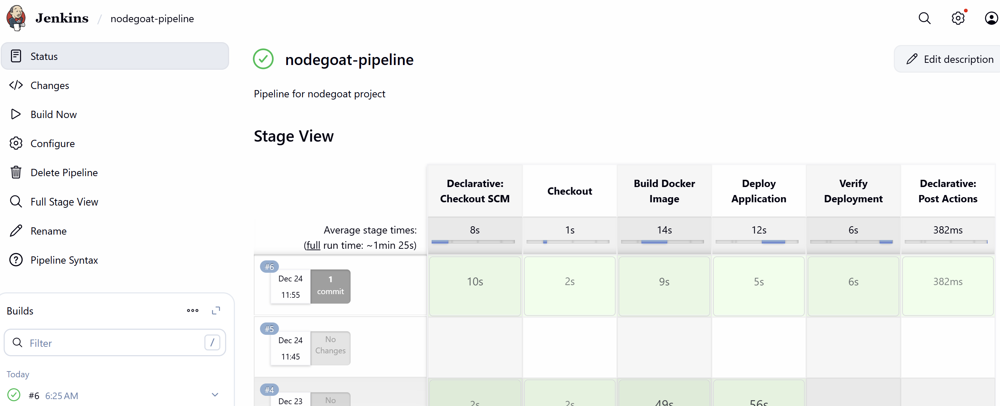
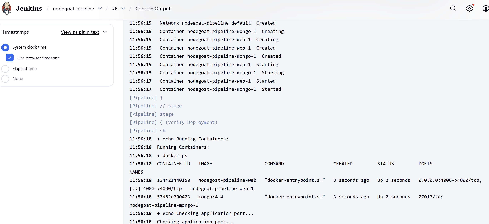
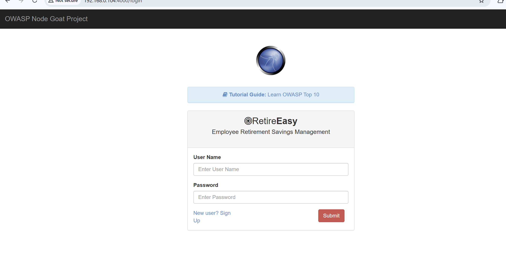
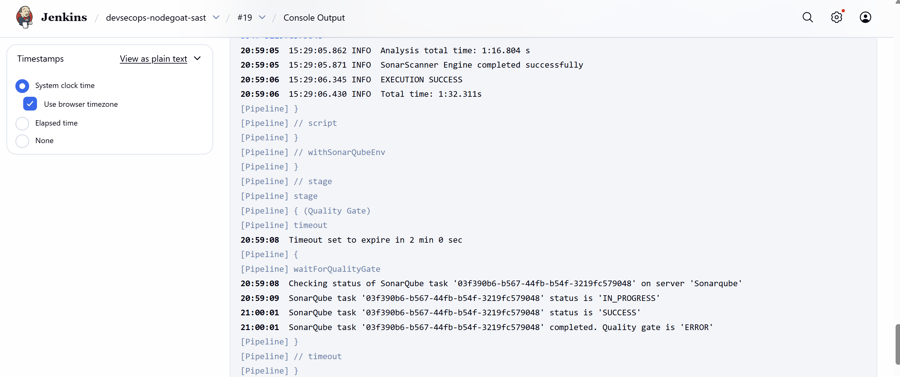
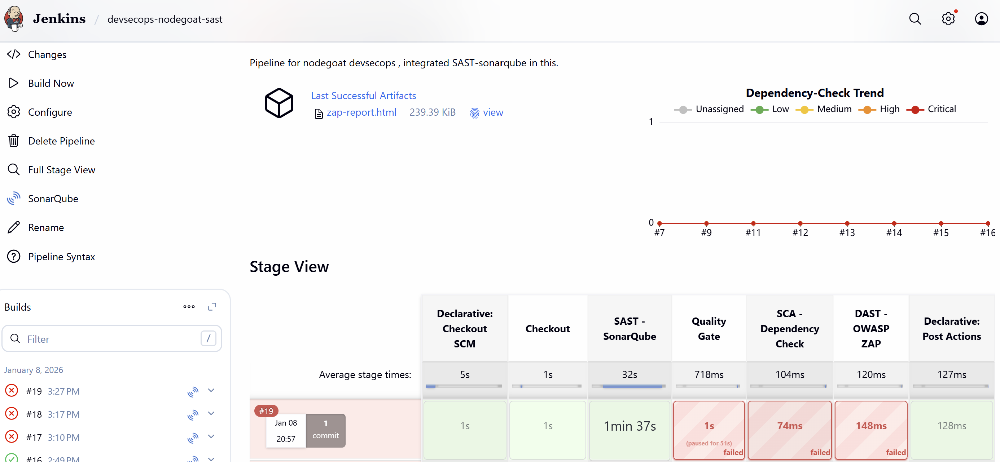
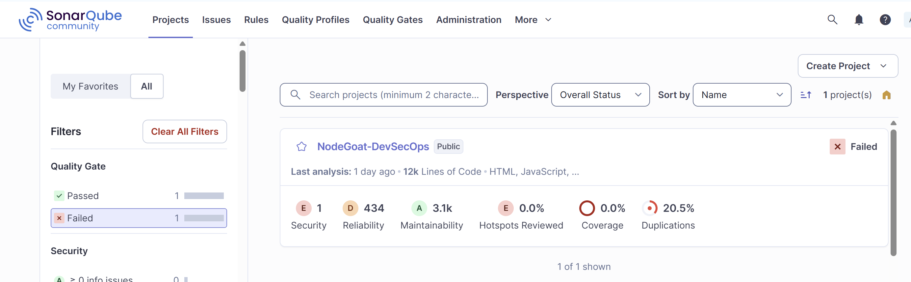
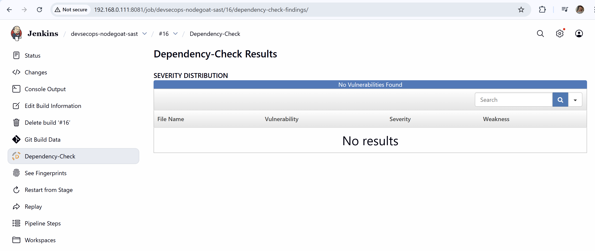
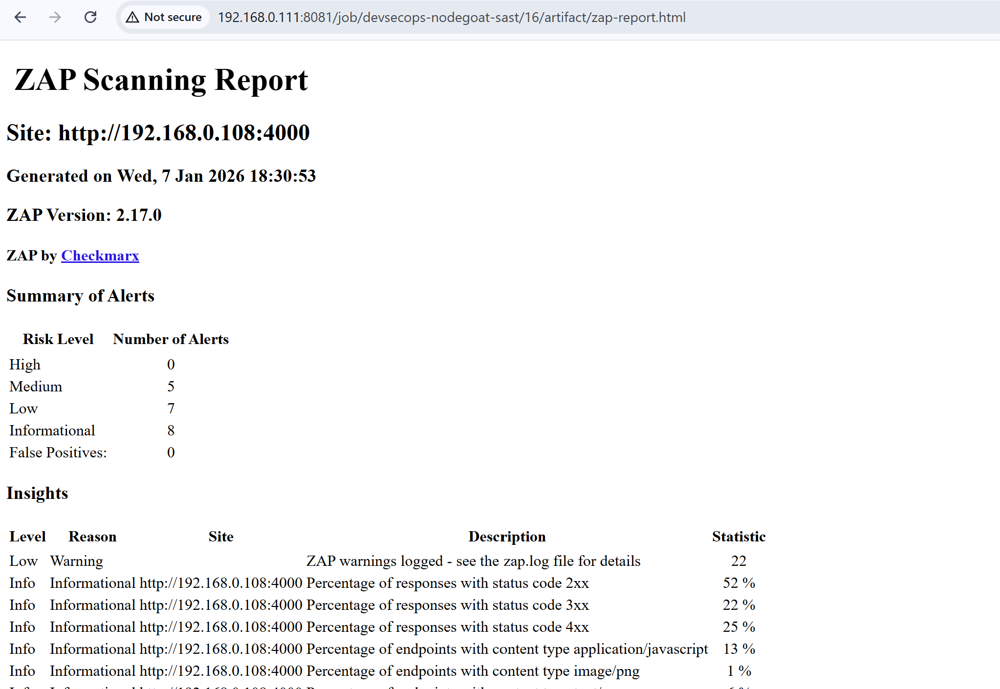

# DevSecOps CI/CD Pipeline – NodeGoat

End-to-end DevSecOps CI/CD pipeline implementation using Jenkins, integrating
SAST, SCA, DAST, and Quality Gates on a deliberately vulnerable Node.js
application (OWASP NodeGoat).

This project demonstrates how security is embedded early and continuously
in the CI/CD lifecycle.

---

## Project Overview

This repository implements a realistic DevSecOps pipeline that:

- Builds and analyzes a Node.js application
- Performs Static Application Security Testing (SAST) using SonarQube
- Enforces Quality Gates
- Runs Software Composition Analysis (SCA) using OWASP Dependency-Check
- Executes Dynamic Application Security Testing (DAST) using OWASP ZAP
- Publishes security reports as Jenkins artifacts

NOTE:
NodeGoat is intentionally vulnerable. Pipeline failures due to security
findings are expected and intentional.

---

## Architecture

Developer
  |
  |  Git Push
  v
GitHub Repository
  |
  v
Jenkins (CI/CD Orchestrator)
  |
  |-- SAST (SonarQube)
  |-- Quality Gate Enforcement
  |-- SCA (OWASP Dependency-Check)
  |-- DAST (OWASP ZAP)
  |
  v
Security Reports (Artifacts)

---

## Infrastructure Setup

### Virtual Machines

Jenkins Server:
- OS: Ubuntu
- Role: CI/CD Orchestrator

Application Server:
- OS: Ubuntu
- Role: Runs NodeGoat, SonarQube, MongoDB

### Networking

Jenkins VM:
- IP: 192.168.0.111
- Jenkins URL: http://192.168.0.111:8081

Application Server VM:
- IP: 192.168.0.108
- NodeGoat URL: http://192.168.0.108:4000
- SonarQube URL: http://192.168.0.108:9000

---

## CI/CD Pipeline Stages

### 1. Checkout
- Pulls source code from GitHub
- Ensures clean workspace

---

### 2. SAST - SonarQube
- Static code analysis for:
  - Security vulnerabilities
  - Code smells
  - Bugs
  - Duplications
- Uses SonarScanner CLI
- Project Key: nodegoat-devsecops

---

### 3. Quality Gate
- Enforces security and quality policies
- Pipeline fails automatically if gate status is ERROR
- Demonstrates shift-left security

---

### 4. SCA - OWASP Dependency-Check
- Scans third-party dependencies
- Detects known CVEs from NVD
- Publishes HTML vulnerability report
- Integrated with Jenkins Dependency-Check plugin

---

### 5. DAST - OWASP ZAP
- Dynamic scan against running application
- Uses zap-baseline.py
- Detects runtime issues such as:
  - Missing security headers
  - Vulnerable JavaScript libraries
  - Misconfigurations
- HTML report archived in Jenkins

---

### 6. Post Actions
- Archives security reports
- Pipeline result reflects overall security posture

---

## Sample Results

SonarQube:
- Security Rating: FAILED (Expected)
- Coverage: 0 percent
- Duplications: ~20 percent

Dependency-Check:
- No critical dependency vulnerabilities detected

OWASP ZAP:
- Medium, Low and Informational alerts detected
- No High or Critical alerts
- Report archived successfully

---

## 📂 Jenkins Artifacts

- zap-report.html
- Dependency-Check HTML report
- Jenkins console logs

---

## 🛠️ Tools and Technologies

- Jenkins
- SonarQube
- OWASP Dependency-Check
- OWASP ZAP
- Docker and Docker Compose
- Node.js
- MongoDB
- Ubuntu Linux

---

## 🎯 Key DevSecOps Concepts Demonstrated

- Shift-left security
- Automated security gates
- Policy-based pipeline failure
- Secure CI/CD design
- Real vulnerability reporting
- Artifact management
- Multi-VM enterprise-like setup

---

## Why This Project Matters

This project reflects real enterprise DevSecOps pipelines:

- Builds fail when security gates fail
- Security tools are properly integrated
- Vulnerabilities are detected early
- Clear audit trail via Jenkins

---

## Future Improvements

- Add unit test coverage
- Configure custom Quality Gates
- Fail pipeline based on DAST severity
- Add container image scanning
- Deploy pipeline to cloud (AWS or Azure)

---

## 👨‍💻 Author

Jatin Dahiya  
DevOps / DevSecOps Engineer  
TCS - Work From Home  

## 📸 CI/CD Pipeline Execution

### Jenkins Pipeline – Successful Run

### Jenkins Console Output

### Application Running

### Jenkins Console - Failed at Quality Gate

### Jenkins Pipeline Dashboard - Fail

### Sonar Dashboard 

### Dependency Check Report - No Vulnerabilities

### ZAP Report

